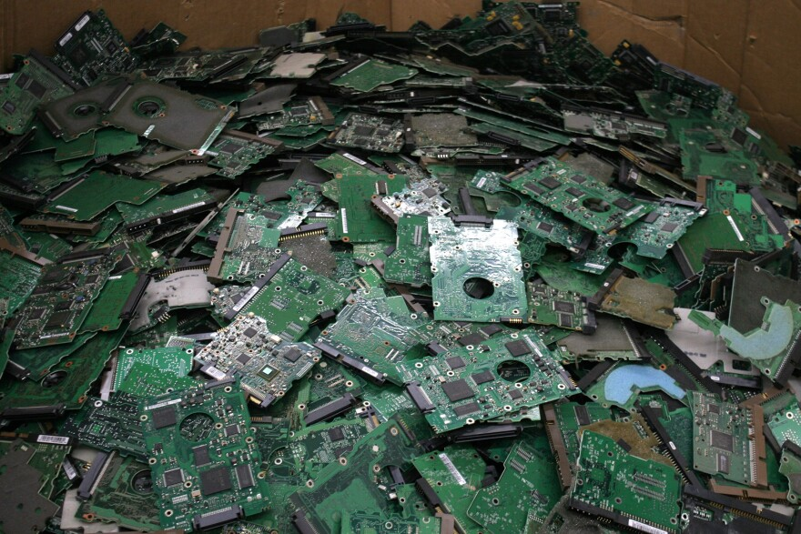

# Residuos Informáticos

## 1. Introducción
Los **residuos informáticos** o **residuos electrónicos (e-waste)** son dispositivos tecnológicos que ya no se utilizan o han quedado obsoletos, como computadoras, teléfonos móviles, impresoras y monitores.

El rápido avance de la tecnología provoca que cada año se generen millones de toneladas de basura electrónica en todo el mundo.

---

## 2. Ejemplo de residuos informáticos

Los residuos informáticos incluyen:

- Computadoras viejas  
- Monitores dañados  
- Teléfonos móviles antiguos  
- Teclados y ratones  
- Cables y cargadores  
- Impresoras y escáneres  

---

## 3. Componentes electrónicos

Los dispositivos electrónicos contienen distintos materiales:

### Materiales valiosos
- Oro  
- Plata  
- Cobre  
- Aluminio  

### Materiales peligrosos
- Plomo  
- Mercurio  
- Cadmio  

Si no se gestionan correctamente pueden contaminar el medio ambiente.

---

## 4. Impacto ambiental

Los residuos electrónicos pueden causar:

- Contaminación del suelo  
- Contaminación del agua  
- Contaminación del aire  
- Problemas de salud en las personas  

---

## 5. Reciclaje de residuos informáticos

El reciclaje permite:

- Recuperar materiales valiosos  
- Reducir la contaminación  
- Disminuir la cantidad de basura tecnológica  
- Aprovechar recursos naturales

---

## 6. Cómo reducir los residuos electrónicos

Algunas formas de ayudar son:

- Reparar dispositivos antes de tirarlos  
- Donar computadoras que aún funcionen  
- Reciclar en centros especializados  
- Comprar dispositivos más duraderos  

---

## 7. Conclusión
Los residuos informáticos son uno de los problemas ambientales que más crece en el mundo. Una correcta gestión mediante **reutilización, reparación y reciclaje** es fundamental para proteger el medio ambiente.
